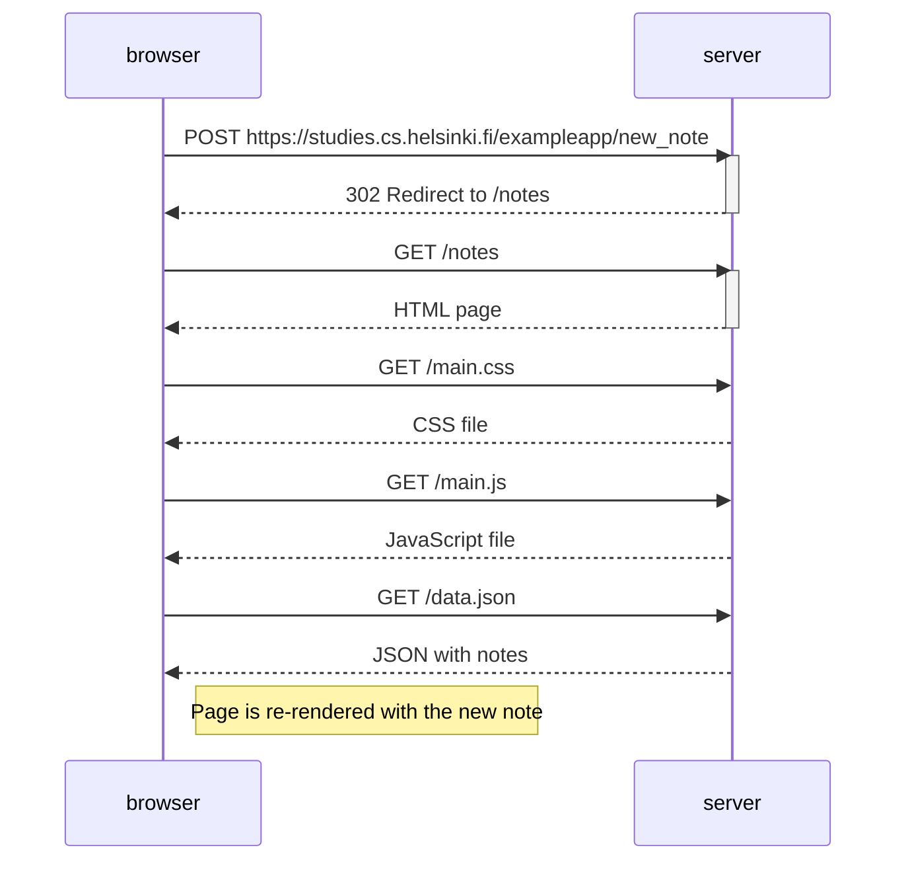

```mermaid
sequenceDiagram
    participant browser
    participant server

    browser->>server: POST https://studies.cs.helsinki.fi/exampleapp/new_note
    activate server
    server-->>browser: 302 Redirect to /notes
    deactivate server

    browser->>server: GET /notes
    activate server
    server-->>browser: HTML page
    deactivate server

    browser->>server: GET /main.css
    server-->>browser: CSS file

    browser->>server: GET /main.js
    server-->>browser: JavaScript file

    browser->>server: GET /data.json
    server-->>browser: JSON with notes

    Note right of browser: Page is re-rendered with the new note
```
