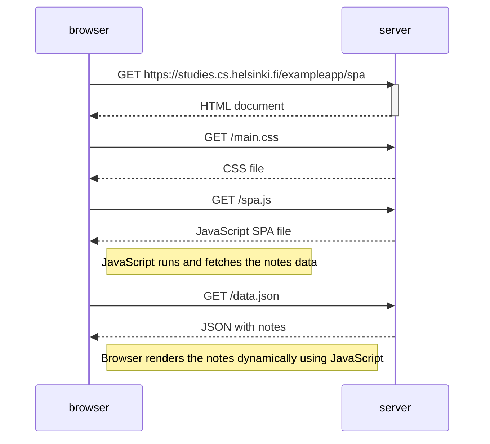

```mermaid
sequenceDiagram
    participant browser
    participant server

    browser->>server: GET https://studies.cs.helsinki.fi/exampleapp/spa
    activate server
    server-->>browser: HTML document
    deactivate server

    browser->>server: GET /main.css
    server-->>browser: CSS file

    browser->>server: GET /spa.js
    server-->>browser: JavaScript SPA file

    Note right of browser: JavaScript runs and fetches the notes data

    browser->>server: GET /data.json
    server-->>browser: JSON with notes

    Note right of browser: Browser renders the notes dynamically using JavaScript
```
